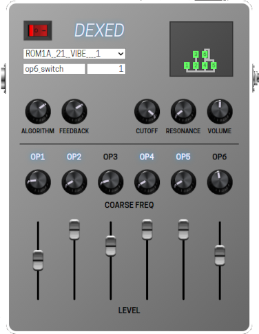

# Dexed MOD UI

LV2 plugin host [mod-host](https://github.com/moddevices/mod-host) allows having a custom user interface (UIs) for a LV2 plugin. Dexed MOD UI provides such a UI for the well-known LV2 plugin Dexed. It allows easy access to often used parameters.



## Features

* Encoders for algorithm and feedback
* Encoders for cutoff, resonance, and output volume
* Direct access to coarse ratio and level of each operator
* Operator labels serve as on/off switches and indicate carriers
* Algorithm visualization
* Bypass switch
* Supports LV2 ports of dcoredump and DISTRHO

## Future Direction

* Finalize algorithm visualization
* Add a parameter value display
* Add operator parameters in a spreadsheet-like manner

## Getting Started

Create a local copy of your Dexed LV2 plugin in your LV2 user folder (most likely `~/.lv2`). Depending on your installation location this might look like this ```cp -r /usr/lib/lv2/Dexed.lv2 ~/.lv2/```. Clone this repository or copy the contents of this repository into your local Dexed folder (`~/.lv2/Dexed.lv2/` in the example above). In case you are targeting the Dexed DISTHRO port apply the patch in `distrho_manifest.ttl.patch`, i.e. ```patch manifest.ttl distrho_manifest.ttl.patch```. Start mod-host and enjoy your new Dexed UI.

## Related projects

* [Dexed](https://github.com/asb2m10/dexed): Original project
* [dexed.lv2](https://github.com/dcoredump/dexed.lv2): dcoredump's LV2 port with MOD UI
* [Dexed DISTRHO port](https://github.com/DISTRHO/DISTRHO-Ports/tree/master/ports-legacy/dexed): LV2 port based on DISTRHO framework
* [modgui/dexed.lv2](https://github.com/popololo46/modgui/tree/main/dexed.lv2): mod-host UI for dexed.lv2 that sports all parameters

## License

Copyright (c) 2021 Daniel Appelt

Distributed under the GPL-3.0 License, same as mod-sdk and Dexed. See [License file](LICENSE).
